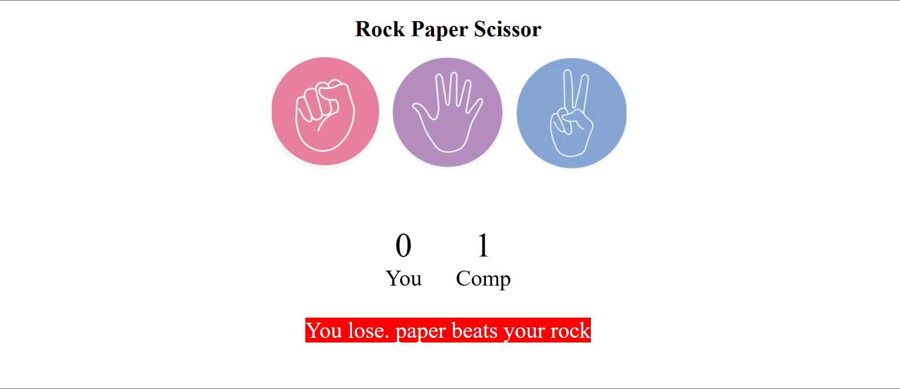

# 🪨📄✂️ Rock-Paper-Scissors Game

An interactive browser-based Rock-Paper-Scissors game built using **HTML**, **CSS**, and **JavaScript**. Challenge the computer in this visually engaging, responsive game and see if you can beat it!


## 🎮 Features

- User vs Computer gameplay
- Visual icons for Rock, Paper, and Scissors
- Dynamic message display and score tracking
- Color-coded feedback for wins, losses, and draws
- Fully responsive and intuitive design


## 🌐 Live Demo

👉 [Play the Game on GitHub Pages](https://sindhubodapati.github.io/Rock-Paper-Scissors/) 


## 📸 Screenshots

### 🎮 Game Interface


### 🏆 Winner Announcement


## 📁 Project Structure

```bash
Rock-Paper-Scissors/
├── index.html       # Main HTML structure
├── style.css        # Styling for layout and visuals
├── app.js           # Game logic and interactivity
├── rock.png         # Rock icon
├── paper.png        # Paper icon
└── scissor.png      # Scissor icon
```

## 🚀 How to Run Locally
1. Clone the repository
 ```
git clone https://github.com/Sindhubodapati/Rock-Paper-Scissors.git
```

3. Navigate to the project directory
```
cd Rock-Paper-Scissors
```

Open index.html in any web browser

Double-click the file or run:
```
open index.html   # macOS
start index.html  # Windows
```
## 🛠️ Tech Stack
   - HTML5
   - CSS3
   - JavaScript (ES6)

## 🎮 How to Play
   - Click on Rock, Paper, or Scissors.
   - The computer will randomly select one of the three.
   - The winner is determined based on standard rules:
        - Rock beats Scissors
        - Scissors beats Paper
        - Paper beats Rock

## ⭐ Features
   - Simple and intuitive UI
   - Hover effects for interactivity
   - Live score tracking
   - Dynamic result messages with color-coded feedback


